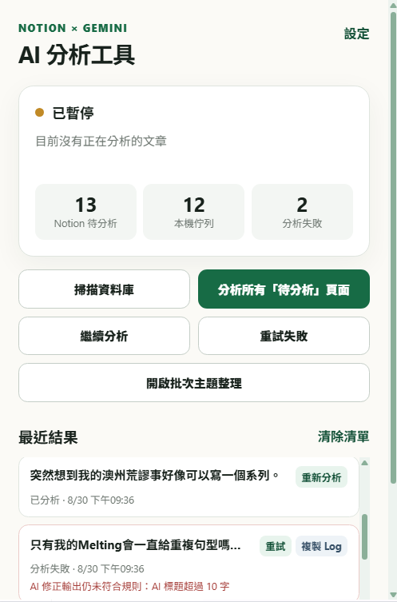
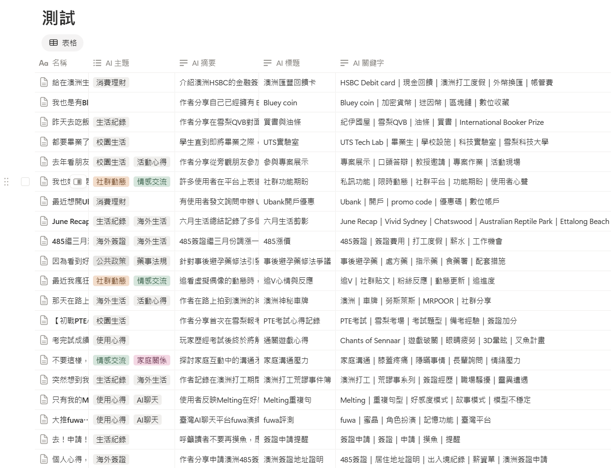
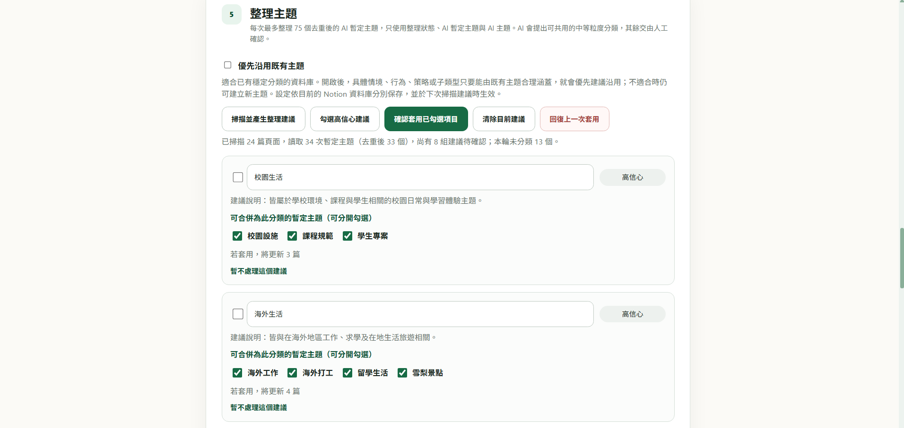
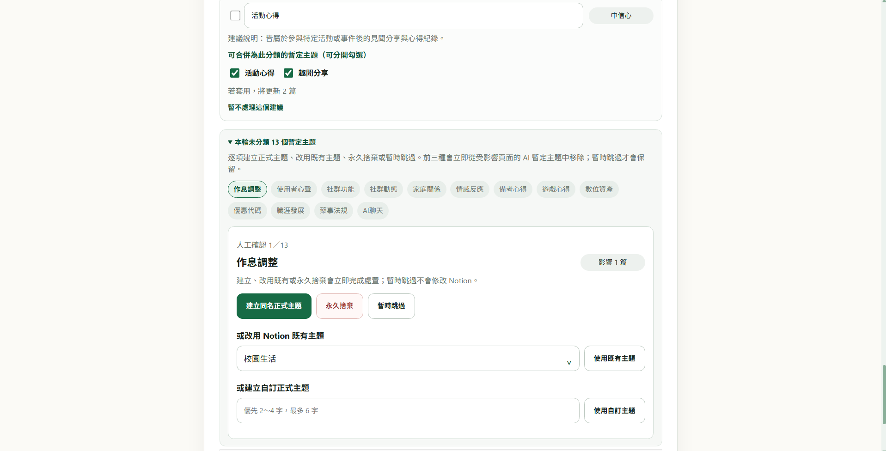

# Notion AI 分析工具

> 讓 AI 負責初步整理，讓你保留最後的分類決定權。

這是一個協助你使用 AI 整理 Notion 文章的 Chrome 擴充功能。
它會分析頁面中的純文字，產生繁體中文標題、摘要、關鍵字與暫定主題，再將結果寫回 Notion。

英文版：[`README.md`](README.md)

使用者介面採用符合臺灣語言習慣的繁體中文；程式碼與開發文件主要以英文維護。

## 使用需求

- Google Chrome 與 Notion 網頁版
- 一個用來存放文章的 Notion 資料庫
- 已獲准存取該資料庫的 Notion Integration Token
- Google AI Studio 或 Vertex AI 其中一家的 API Key

本工具以設定的 Notion 資料庫為單位，分析屬於該資料庫的頁面。
擴充功能需在 Chrome 中搭配 Notion 網頁版操作，不支援直接在 Notion 桌面版或行動版中使用。

## 為什麼做這個

把文章存進 Notion 很容易，真正花時間的是之後的命名、摘要、標記關鍵字與分類。
當收藏的內容逐漸增加，完全依靠人工整理不但費時，也很難長期維持一致。

但如果直接讓 AI 決定正式主題，又可能產生重複、過度細分或不符合個人使用習慣的分類。

因此，本工具將流程拆成兩個階段：先由 AI 分析文章並產生暫定結果，再由使用者檢查整理建議，決定最後要採用的正式主題。
AI 負責減少重複工作，但不會取代使用者對知識庫分類方式的決定。

## 適合用來做什麼

本工具適合整理儲存在 Notion 中的：

- 文章收藏與稍後閱讀內容
- 閱讀筆記與研究資料
- 社群貼文與個人紀錄
- 持續累積、需要搜尋與分類的文字內容

它會讀取指定 Notion 資料庫中的頁面純文字，透過你選擇的 AI 服務完成分析，再把結構化結果寫回原本的資料庫。

## 使用流程

1. 在 Notion 將準備處理的頁面設為「待分析」。
2. 分析目前頁面，或掃描資料庫後開始批次分析。
3. 將 AI 標題、摘要、關鍵字與暫定主題寫回 Notion。
4. 掃描累積的暫定主題，產生整理建議。
5. 由使用者確認、修改或捨棄建議，完成正式分類。

## 安裝方法

本工具目前尚未發布至 Chrome 線上應用程式商店，需從 GitHub 下載並手動安裝。

1. 在 GitHub 的 **Releases** 頁面下載最新版本；若尚未提供 Release，也可以按 **Code → Download ZIP**。
2. 將下載的 ZIP 完整解壓縮至固定資料夾。
3. 在 Chrome 網址列輸入 `chrome://extensions`。
4. 開啟右上角的「開發人員模式」。
5. 按下「載入未封裝項目」。
6. 選擇解壓縮後、內含 `manifest.json` 的資料夾。
7. 開啟擴充功能設定頁，填入 Notion Integration Token、Notion 資料庫網址或 Data Source ID，以及所選 AI 服務商的 API Key。
8. 按下「測試連線並準備欄位」，完成連線與資料庫欄位設定。

使用前，請先確認 Notion Integration 已取得目標資料庫的存取權限。

由 GitHub 手動安裝的版本不會自動更新。下載新版本並替換原本檔案後，請回到 `chrome://extensions`，按下擴充功能卡片上的「重新載入」。

## 功能介紹

### 分析目前頁面或批次處理

在單篇 Notion 頁面中，可以直接分析目前內容；在資料庫頁面中，則可以掃描「待分析」文章並開始批次處理。

批次執行期間可以查看待分析、本機佇列與失敗數量，也可以停止、繼續或重試失敗項目。
切換 Notion 頁面時，正在執行的佇列不會因此中斷。

單次掃描最多接受 2,000 篇待分析文章；若超過上限，工具會在建立不完整佇列前停止，並提示先縮小待處理範圍。每次重試失敗項目最多載入 40 篇。

  

### 產生結構化的 Notion 內容

每篇文章可以產生：

- AI 標題
- AI 摘要
- AI 關鍵字
- AI 暫定主題

分析結果會直接寫入對應的 Notion 欄位，讓原本只有文章內容的資料庫更容易瀏覽、篩選與搜尋。

`AI 暫定主題` 是 AI 對單篇文章提出的候選分類，`AI 主題` 則是經過確認的正式分類。
批次分析只會建立暫定主題，不會直接改動既有的正式主題。

### 整理重複或相近的主題

隨著文章增加，AI 可能產生意思相近但名稱不同的暫定主題。
主題整理功能會讀取累積的候選名稱，提出較一致、適合長期使用的分類建議。

每項建議會顯示：

- 建議採用的正式主題名稱
- 可以合併到這個分類的暫定主題
- 建議原因與信心程度
- 套用後會影響的文章數量

如果資料庫已經有一套穩定分類，也可以讓整理功能優先參考既有主題，減少不必要的新分類。
主題整理只使用整理狀態、暫定主題與既有正式主題，不會重新傳送文章正文、摘要或關鍵字。

### 由使用者確認最後分類

所有整理建議都必須經過人工確認才會套用。你可以選擇：

- 建立建議的正式主題
- 改用 Notion 中已有的主題
- 輸入自己的主題名稱
- 永久捨棄不需要的候選
- 暫時跳過，留待之後重新整理

無法合理合併的項目會保留在「本輪未分類」，不會為了完成分組而被強制放入不適合的分類。

### 選擇 AI 服務商

目前支援：

- Google AI Studio
- Vertex AI

你可以自行選擇服務商與模型。文章只會傳送到目前選擇的服務商，不會同時傳送給其他服務商。

## 進階分析設定

你可以依照資料庫用途調整 AI 產生的內容長度與數量。例如，文章收藏可以使用較短的摘要與較少的主題；研究筆記則可以保留更完整的摘要和關鍵字。

預設值與可設定範圍如下：

| 設定 | 預設值 | 可設定範圍 |
| --- | ---: | ---: |
| AI 標題字數上限 | 12 字 | 6–30 字 |
| 暫定主題最少數量 | 1 個 | 1–5 個 |
| 暫定主題最多數量 | 3 個 | 1–5 個 |
| 關鍵字數量 | 5 個 | 3–10 個 |
| 摘要最少字數 | 100 字 | 50–500 字 |
| 摘要最多字數 | 250 字 | 100–800 字 |

暫定主題的最少數量不能高於最多數量，摘要的最少字數也不能高於最多字數。

這些設定會同時套用到 AI 提示詞、輸出格式與結果檢查，確保實際產生的內容符合選定規格。

為了控制安全性與資源使用，每篇文章的純文字上限為 120,000 字元。接近上限時，擴充功能會請目前選擇的 Google 服務計算完整 prompt，超過 350,000 個輸入 token 就不會送出分析；單次 AI 回應最多要求 8,192 個輸出 token。

### 自訂分析提示詞

你可以修改用來分析文章的提示詞，以配合自己的內容類型與整理方式。設定頁也提供：

- 複製目前提示詞
- 預覽實際送出的提示詞
- 恢復預設提示詞
- 恢復預設輸出規格

提示詞與輸出規格分開管理。恢復其中一項的預設值時，不會清除另一項的自訂內容。

### AI 等待時間

單次 AI 分析的等待上限可以設為：

- 3 分鐘
- 5 分鐘（預設）
- 10 分鐘
- 不限制

如果超過等待時間，工具會停止該次要求並暫停批次佇列，不會自動重新傳送整篇文章。

## 開發方式

本專案由 Penny Hsieh 發想並持續維護，包含需求定義、操作流程、介面方向與成果驗收。程式實作、重構與文件整理主要在 OpenAI Codex 協助下完成。產品方向與發布決定由 Penny Hsieh 負責。

## 隱私

本擴充功能不使用開發者自建的中介伺服器，也沒有分析追蹤或遙測。

文章純文字會從 Notion 傳送到你所選擇的 AI 服務商；未選擇的服務商不會收到內容。圖片、影片、音訊、檔案與 PDF 不會作為文章分析內容。

詳細資料流請見 [`PRIVACY.zh-TW.md`](PRIVACY.zh-TW.md)（[英文](PRIVACY.md)）。
